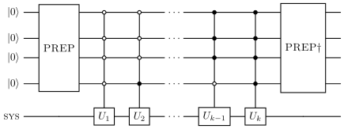

Block encoding of molecular Hamiltonian
=======================================

Quantum computers only run unitary operations. However, the qubit
Hamiltonians that were mapped from molecular Hamiltonians are not
unitary. Block encoding a matrix representation of the molecular
Hamiltonian allows their processing by quantum algorithms like time
evolution and other matrix functions. The objective of block encoding is
to embed a (scaled) operator :math:`H/\lambda` into the upper-left block
of a matrix U using ancilla qubits:

.. math:: U = \begin{pmatrix} H/\lambda & * \\ * & * \end{pmatrix}

For a normalization factor :math:`\lambda \geq ||H||` the block encoding
satisfies

.. math:: H = \lambda (\langle 0 | \otimes I )| U |(I \otimes |0\rangle )

In this tutorial, we shall start with the molecular Hamiltonian for H2,
map that to a qubit Hamiltonian using Jordan-Wigner mapping, and then
block encode the qubit Hamiltonian into a circuit with unitary
:math:`U`.

.. code:: ipython3

    from qibochem.driver import Molecule
    import numpy as np

    # perform the PySCF calculation to get the integrals and thus, second-quantized Hamiltonian
    h2 = Molecule([('H', (0.0, 0.0, 0.0)), ('H', (0.0, 0.0, 0.7))])
    h2.run_pyscf()

    # retrieve the symbolic qubit hamiltonian, which is already a linear combination of unitaries (LCU)
    sym_hamiltonian = h2.hamiltonian('sym')

.. parsed-literal::

    [Qibo 0.3.4|INFO|2026-08-28 17:17:49]: Using numpy backend on /CPU:0

.. code:: ipython3

    # obtain the coefficients, Pauli operators, and the target qubits from the Hamiltonian
    coeffs = sym_hamiltonian.simple_terms[0]
    raw_opp = sym_hamiltonian.simple_terms[1]
    raw_opq = sym_hamiltonian.simple_terms[2]

    # reverse the order of the Pauli operations for each term to effect their order of application on the input state
    opp = [p[::-1] for p in raw_opp]
    opq = [q[::-1] for q in raw_opq]

    # append the constant term:
    coeffs.append(sym_hamiltonian.constant)
    opp.append('I')
    opq.append((0,))

PREP circuit
------------

For our Hamiltonian, which is already a linear combination of unitaries:

.. math:: H = \sum_{k=0}^{N-1}\alpha_k U_k

the PREP circuit takes in the :math:`|0\rangle` state and encodes:

.. math:: \mathrm{PREP}|0\rangle = \sum_k \sqrt{\frac{|\alpha_k|}{\lambda}} |k\rangle

We need to:

- calculate ``lcu_norm``, the normalization factor :math:`\lambda`
- calculate ``alphas``, the coefficients of the basis states
  :math:`|k\rangle`, that is, :math:`\sqrt{\frac{|\alpha_k|}{\lambda}}`
- determine the number of qubits to represent the basis states
  :math:`|k\rangle`
- Encode them using some binary encoder; in our case we shall use the
  Mottonen-complex encoder available in ``qibo.models.encodings``.

.. code:: ipython3

    lcu_norm = np.sum(np.abs(coeffs))
    alphas = np.sqrt(np.abs(coeffs)/lcu_norm)

    # ensure that the state |k> will be normalized
    print('Norm of |k> = ', np.linalg.norm(alphas))
    print('Number of terms in |k> = ', len(alphas))

.. parsed-literal::

    Norm of |k> =  1.0
    Number of terms in |k> =  15

.. code:: ipython3

    # determine qubits needed
    nq1 = int(np.ceil(np.log2(len(alphas))))

    # pad the alpha vector such that it has the exact number of terms for nq1 qubits
    pad_size = (2 ** nq1) - len(alphas)
    temp1 = np.array(alphas, dtype=complex)
    temp2 = np.zeros(pad_size, dtype=complex)
    pad_alphas = np.concatenate((temp1, temp2))

.. code:: ipython3

    # encode this state vector into the circuit.

    from qibo.models.encodings import binary_encoder

    circuit_PREP = binary_encoder(nqubits=nq1, parametrization='mottonen-complex', data=pad_alphas)
    circuit_PREP.draw()

.. parsed-literal::

    0:     ─RY─o────o─────────o─────────o───────────────────o───────────────────o ...
    1:     ─RY─X─RY─X────o────|────o────|─────────o─────────|─────────o─────────| ...
    2:     ───────────RY─X─RY─X─RY─X─RY─X────o────|────o────|────o────|────o────| ...
    3:     ───────────────────────────────RY─X─RY─X─RY─X─RY─X─RY─X─RY─X─RY─X─RY─X ...

    0: ... ─RZ─o────o─────────o─────────o───────────────────o───────────────────o ...
    1: ... ─RZ─X─RZ─X────o────|────o────|─────────o─────────|─────────o─────────| ...
    2: ... ───────────RZ─X─RZ─X─RZ─X─RZ─X────o────|────o────|────o────|────o────| ...
    3: ... ───────────────────────────────RZ─X─RZ─X─RZ─X─RZ─X─RZ─X─RZ─X─RZ─X─RZ─X ...

    0: ... ─
    1: ... ─
    2: ... ─
    3: ... ─

.. code:: ipython3

    # save the elements as a list for checking
    state_PREP = circuit_PREP()
    state_PREP_elements = state_PREP.to_dict()['state']

SELECT circuit
--------------

The SELECT circuit is used within an LCU frameworkf to apply specific
target unitary operators :math:`U_k` to a system register conditioned on
an ancilla state :math:`|k\rangle`.

.. math:: \mathrm{SELECT}|k\rangle \psi\rangle = |k\rangle U_k |\psi\rangle

The k-th unitary :math:`U_k` is applied to the system register only when
the ancilla register holds the state :math:`|k\rangle`

This implementation uses multi-qubit controlled Pauli gates, but also
adds a multi-control Z gate if the coefficient is negative to account
for phase.

.. code:: ipython3

    import qibo
    from qibo import Circuit, gates, models

    circuit_SELECT = Circuit(nq1 + sym_hamiltonian.nqubits)

.. code:: ipython3

    # Helper function to return the correct Qibo Pauli gate
    def get_pauli_gate(pauli_char, target_qubit):
        if pauli_char == 'X':
            return gates.X(target_qubit)
        elif pauli_char == 'Y':
            return gates.Y(target_qubit)
        elif pauli_char == 'Z':
            return gates.Z(target_qubit)
        elif pauli_char == 'I':
            return gates.I(target_qubit)
        else:
            raise ValueError(f"Unsupported gate: {pauli_char}")

.. code:: ipython3

    bitlength = nq1
    select_controls = []

    for _i in range(2**nq1):
        control_string = f"{_i:0{bitlength}b}"
        select_controls.append(control_string)

.. code:: ipython3

    # Define control qubits and target qubit mapping
    control_qubits = (0, 1, 2, 3)
    target_map = {0: 4, 1: 5, 2: 6, 3: 7}

    # Iterate through the operations
    for i in range(len(opp)):
        control_state = select_controls[i]
        pauli_string = opp[i]
        targets_unmapped = opq[i]
        coeff = coeffs[i]  # Get the original coefficient to check its sign

        # Step 1: Apply X gates on control qubits that need to be conditioned on '0'
        for j, bit in enumerate(control_state):
            if bit == '0':
                circuit_SELECT.add(gates.X(control_qubits[j]))

        # Step 2: Apply the multi-controlled Pauli gates to the mapped target qubits
        for j, pauli_char in enumerate(pauli_string):
            unmapped_target = targets_unmapped[j]
            target_qubit = target_map[unmapped_target]

            # Create base gate and add controls
            base_gate = get_pauli_gate(pauli_char, target_qubit)
            controlled_gate = base_gate.controlled_by(*control_qubits)

            circuit_SELECT.add(controlled_gate)

        # Step 3: Apply multi-controlled -1 phase for negative coefficients
        if coeff.real < 0:
            # Multi-controlled Z applies a -1 phase to the state |11...1>
            circuit_SELECT.add(gates.Z(control_qubits[-1]).controlled_by(*control_qubits[:-1]))

        # Step 4: Uncompute the X gates to restore the control qubits
        for j, bit in enumerate(control_state):
            if bit == '0':
                circuit_SELECT.add(gates.X(control_qubits[j]))

.. code:: ipython3

    # Display a summary of the generated circuit

    print(circuit_SELECT.draw())
    #print(circuit_SELECT.summary())

.. parsed-literal::

    0:     ─X─o─X─X─o─X─X─o─o─X─X─o─o─X─X─o─o─X─X─o─o─X─X─o─o─X─X─o─o─X─o─o─────o ...
    1:     ─X─o─X─X─o─X─X─o─o─X─X─o─o─X───o─o─────o─o─────o─o─────o─o─X─o─o─X─X─o ...
    2:     ─X─o─X─X─o─X───o─o─────o─o─X───o─o─X─X─o─o─X───o─o─────o─o─X─o─o─X─X─o ...
    3:     ─X─o─X───o─X───o─Z─X───o─Z─X───o─o─X───o─o─X───o─o─X───o─o─X─o─o─X───o ...
    4:     ───|─────Z─────|───────|───────|─Z─────|─|─────|─|─────|─Z───|─|─────| ...
    5:     ───Z───────────|───────|───────|───────|─Z─────|─|─────|─────|─Z─────Z ...
    6:     ───────────────Z───────|───────Z───────|───────|─Z─────|─────Z──────── ...
    7:     ───────────────────────Z───────────────Z───────Z───────Z────────────── ...

    0: ... ─o─────o─o─o─o─────o─o─o─o───o─o─o─o─o─────o─o─o─o─o───o─o───
    1: ... ─o─X─X─o─o─o─o─X─X─o─o─o─o─X─o─o─o─o─o─────o─o─o─o─o───o─o───
    2: ... ─o─X───o─o─o─o─────o─o─o─o─X─o─o─o─o─o─X─X─o─o─o─o─o─X─o─o───
    3: ... ─o─X───o─o─o─o─X───o─o─o─o─X─o─o─o─o─Z─X───o─o─o─o─Z─X─o─Z─X─
    4: ... ─Z─────|─|─|─X─────|─|─|─Y───|─|─|─X───────|─|─|─Y─────I─────
    5: ... ───────|─|─Y───────|─|─X─────|─|─X─────────|─|─Y─────────────
    6: ... ───────|─Y─────────|─X───────|─Y───────────|─X───────────────
    7: ... ───────X───────────Y─────────Y─────────────X─────────────────
    None

PREP\ :math:`\dagger`
---------------------

The inverse PREP is implemented easily using the ``.invert()`` method
for the PREP circuit earlier.

.. code:: ipython3

    # prep_dagger

    circuit_PREP_dag = circuit_PREP.invert()

Final circuit
-------------

Assemble the block encoding circuit for above Hamiltonian by piecing
everything together.

.. code:: ipython3

    circuit_BLOCKENCODE = Circuit(nq1 + sym_hamiltonian.nqubits)

    circuit_BLOCKENCODE.add(circuit_PREP.on_qubits(*range(0,4)))
    circuit_BLOCKENCODE.add(circuit_SELECT.on_qubits(*range(0,8)))
    circuit_BLOCKENCODE.add(circuit_PREP_dag.on_qubits(*range(0,4)))
    #circuit_BLOCKENCODE.add(gates.M(*range(4,8)))

    print(circuit_BLOCKENCODE.draw())

.. parsed-literal::

    0:     ─RY─o────o─────────o─────────o───────────────────o───────────────────o ...
    1:     ─RY─X─RY─X────o────|────o────|─────────o─────────|─────────o─────────| ...
    2:     ───────────RY─X─RY─X─RY─X─RY─X────o────|────o────|────o────|────o────| ...
    3:     ───────────────────────────────RY─X─RY─X─RY─X─RY─X─RY─X─RY─X─RY─X─RY─X ...
    4:     ────────────────────────────────────────────────────────────────────── ...
    5:     ────────────────────────────────────────────────────────────────────── ...
    6:     ────────────────────────────────────────────────────────────────────── ...
    7:     ────────────────────────────────────────────────────────────────────── ...

    0: ... ─RZ─o────o─────────o─────────o───────────────────o───────────────────o ...
    1: ... ─RZ─X─RZ─X────o────|────o────|─────────o─────────|─────────o─────────| ...
    2: ... ───────────RZ─X─RZ─X─RZ─X─RZ─X────o────|────o────|────o────|────o────| ...
    3: ... ───────────────────────────────RZ─X─RZ─X─RZ─X─RZ─X─RZ─X─RZ─X─RZ─X─RZ─X ...
    4: ... ────────────────────────────────────────────────────────────────────── ...
    5: ... ────────────────────────────────────────────────────────────────────── ...
    6: ... ────────────────────────────────────────────────────────────────────── ...
    7: ... ────────────────────────────────────────────────────────────────────── ...

    0: ... ─X─o─X─X─o─X─X─o─o─X─X─o─o─X─X─o─o─X─X─o─o─X─X─o─o─X─X─o─o─X─o─o─────o ...
    1: ... ─X─o─X─X─o─X─X─o─o─X─X─o─o─X───o─o─────o─o─────o─o─────o─o─X─o─o─X─X─o ...
    2: ... ─X─o─X─X─o─X───o─o─────o─o─X───o─o─X─X─o─o─X───o─o─────o─o─X─o─o─X─X─o ...
    3: ... ─X─o─X───o─X───o─Z─X───o─Z─X───o─o─X───o─o─X───o─o─X───o─o─X─o─o─X───o ...
    4: ... ───|─────Z─────|───────|───────|─Z─────|─|─────|─|─────|─Z───|─|─────| ...
    5: ... ───Z───────────|───────|───────|───────|─Z─────|─|─────|─────|─Z─────Z ...
    6: ... ───────────────Z───────|───────Z───────|───────|─Z─────|─────Z──────── ...
    7: ... ───────────────────────Z───────────────Z───────Z───────Z────────────── ...

    0: ... ─o─────o─o─o─o─────o─o─o─o───o─o─o─o─o─────o─o─o─o─o───o─o───o──────── ...
    1: ... ─o─X─X─o─o─o─o─X─X─o─o─o─o─X─o─o─o─o─o─────o─o─o─o─o───o─o───|──────── ...
    2: ... ─o─X───o─o─o─o─────o─o─o─o─X─o─o─o─o─o─X─X─o─o─o─o─o─X─o─o───|────o─── ...
    3: ... ─o─X───o─o─o─o─X───o─o─o─o─X─o─o─o─o─Z─X───o─o─o─o─Z─X─o─Z─X─X─RZ─X─RZ ...
    4: ... ─Z─────|─|─|─X─────|─|─|─Y───|─|─|─X───────|─|─|─Y─────I────────────── ...
    5: ... ───────|─|─Y───────|─|─X─────|─|─X─────────|─|─Y────────────────────── ...
    6: ... ───────|─Y─────────|─X───────|─Y───────────|─X──────────────────────── ...
    7: ... ───────X───────────Y─────────Y─────────────X────────────────────────── ...

    0: ... ───────────o───────────────────o─────────o─────────o────o─RZ─o──────── ...
    1: ... ─o─────────|─────────o─────────|────o────|────o────X─RZ─X─RZ─|──────── ...
    2: ... ─|────o────|────o────|────o────X─RZ─X─RZ─X─RZ─X─RZ───────────|────o─── ...
    3: ... ─X─RZ─X─RZ─X─RZ─X─RZ─X─RZ─X─RZ───────────────────────────────X─RY─X─RY ...
    4: ... ────────────────────────────────────────────────────────────────────── ...
    5: ... ────────────────────────────────────────────────────────────────────── ...
    6: ... ────────────────────────────────────────────────────────────────────── ...
    7: ... ────────────────────────────────────────────────────────────────────── ...

    0: ... ───────────o───────────────────o─────────o─────────o────o─RY─
    1: ... ─o─────────|─────────o─────────|────o────|────o────X─RY─X─RY─
    2: ... ─|────o────|────o────|────o────X─RY─X─RY─X─RY─X─RY───────────
    3: ... ─X─RY─X─RY─X─RY─X─RY─X─RY─X─RY───────────────────────────────
    4: ... ─────────────────────────────────────────────────────────────
    5: ... ─────────────────────────────────────────────────────────────
    6: ... ─────────────────────────────────────────────────────────────
    7: ... ─────────────────────────────────────────────────────────────
    None

Now compare the :math:`H/\lambda` (``H_lam_mat``) and the 16 by 16
upper-left block of the circuit unitary (``U16_mat``) to see if the
Hamiltonian is successfully block encoded.

.. code:: ipython3

    # Compare
    H_lam_mat = sym_hamiltonian.matrix / lcu_norm
    U16_mat = circuit_BLOCKENCODE.unitary()[0:16, 0:16]

    print(np.allclose(H_lam_mat, U16_mat))

.. parsed-literal::

    True
