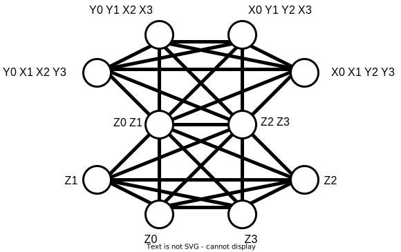

Expectation from samples
========================

The previous examples were all carried out using state vector simulations of the quantum circuit.
However, in actual quantum hardware, the expectation value of the molecular Hamiltonian for a parameterized quantum circuit has to be estimated using repeated executions of the circuit, or shots in short.

.. code-block:: python

    from qibochem.driver import Molecule
    from qibochem.ansatz import hf_circuit
    from qibochem.measurement import expectation, expectation_from_samples

    # Build the H2 molecule and get the molecular Hamiltonian
    h2 = Molecule([("H", (0.0, 0.0, 0.0)), ("H", (0.0, 0.0, 0.7))])
    h2.run_pyscf()
    hamiltonian = h2.hamiltonian()
    print(f"Number of terms in the Hamiltonian: {len(hamiltonian.terms)}")

    # Construct a basic Hartree-Fock circuit
    circuit = hf_circuit(h2.nso, h2.nelec)

    # Expectation value using a state vector simulation:
    exact_result = expectation(circuit, hamiltonian)
    # Expectation value using (simulated) shots
    shots_result = expectation_from_samples(circuit, hamiltonian, n_shots=1000)
    print(f"\nExact result: {exact_result:.8f}")
    # There will be a small difference between the exact result and the results with shots
    print(f"Shots result: {shots_result:.8f}")

.. code-block:: output

    Number of terms in the Hamiltonian: 14

    Exact result: -1.11734903
    Shots result: -1.11260552

In the case of the H\ :sub:`2`/STO-3G (4 qubit) example above, there are 14 terms that comprise the molecular Hamiltonian.
In practice, the expectation value for each of the individual Pauli terms have to be obtained using circuit measurements, before summing them up to obtain the overall expectation value of the molecular Hamiltonian.

This process of obtaining the electronic energy (Hamiltonian expectation value) is still reasonable for a small system.
However, the number of Pauli terms in a molecular Hamiltonian scales on the order of :math:`O(N^4)`, where N is the number of qubits.

.. warning::

    The code block below might take a few minutes to run!

.. code-block:: python

    from qibochem.driver import Molecule

    # Build the N2 molecule and get the molecular Hamiltonian
    n2 = Molecule([("N", (0.0, 0.0, 0.0)), ("N", (0.0, 0.0, 1.1))])
    n2.run_pyscf()
    hamiltonian = n2.hamiltonian()
    print(f"Number of terms in the Hamiltonian: {len(hamiltonian.terms)}")

.. code-block:: output

    Number of terms in the Hamiltonian: 2950

Even for the relatively small N\ :sub:`2` molecule with the minimal STO-3G basis set, there are already 2950 (!!!) terms to measure.
Going further, if the electronic energy is evaluated as part of the process of running a VQE, it has to be repeated for each step of the VQE.
Clearly, the measurement cost of running VQE has the potential to become astronomically large, and is a significant practical challenge today.

Reducing the measurement cost
-----------------------------

So far, we have assumed that the expectation value for every term in the molecular Hamiltonian has to be obtained using an independent set of circuit measurements.
However, we know from quantum mechanics that if two observables (the indvidual Pauli terms in the Hamiltonian) commute, they can be measured simultaneously.
More precisely, if two observables commute, they have a common eigenbasis, i.e.

.. math::

    [A, B] = 0 \implies \exists x \text{ such that } A x = a x  \text{ and } B x = b x

where :math:`a` and :math:`b` are real numbers and :math:`x` is a vector.
In other words, a single set of measurements, carried out in the common eigenbasis, can be used to obtain the expectation values of two (or more) commuting observables simultaneously.
What remains is then how to apply the above fact towards the reduction of the measurement cost in practice.

One simple approach is to group qubit-wise commuting terms together, and use a single set of measurements for each group of Pauli terms. [#f1]_

Grouping Hamiltonian terms
--------------------------

First, there is the question of how to sort the Hamiltonian terms into separate groups of mutually commuting terms; i.e. each term in a group commutes with every other term in the same group.
Less groups would imply that a smaller number of measurements are required, which is our eventual goal.

The 14 terms from the molecular Hamiltonian of H\ :sub:`2` with the Jordan-Wigner mapping are as follows:

.. math::

    \begin{align*}
    H = & -0.10973 I + 0.16988 (Z_0 + Z_1) - 0.21886 (Z_2 + Z_3) + 0.16821 Z_0 Z_1 \\
      & + 0.12005 (Z_0 Z_2 + Z_1 Z_3) + 0.16549 (Z_0 Z_3 + Z_1 Z_2) + 0.17395 Z_2 Z_3 \\
      & - 0.04544 (X_0 X_1 Y_2 Y_3 + Y_0 Y_1 X_2 X_3 - X_0 Y_1 Y_2 X_3 - Y_0 X_1 X_2 Y_3)
    \end{align*}

For simplicity, we will only look at a selected subset of the Hamiltonian terms.
These terms can be represented as a graph:

where the nodes of the graph are the Pauli terms, and with edges connecting two nodes only if they commute;
e.g. the :math:`Z_0` term commutes with the :math:`Z_2 Z_3` term, but not with the :math:`X_0 X_1 Y_2 Y_3` term.

It can be seen that a group of commuting terms forms a complete subgraph; i.e. each of the nodes in the subgraph have an edge (are directly connected) to all other members in the subgraph.
In other words, our problem of finding the smallest possible number of groups is the minimum clique cover problem, i.e. finding the smallest number of cliques (groups) of complete graphs.

For the figure above, we can see two possible solutions to this problem:
``[["Z0", "Z1", "Z2", "Z3", "Z0 Z1", "Z2 Z3"], ["X0 Y1 Y2 X3", "Y0 X1 X2 Y3", "X0 X1 Y2 Y3", "Y0 Y1 X2 X3"]]``, or ``[["Z0", "Z1", "Z2", "Z3"], ["Z0 Z1", "Z2 Z3", "X0 Y1 Y2 X3", "Y0 X1 X2 Y3", "X0 X1 Y2 Y3", "Y0 Y1 X2 X3"]]``.
Although this is a NP-hard problem in general, there are polynomial-time algorithms that yield approximate solutions, and these algorithms are available in the NetworkX library (see example below).

Qubit-wise commuting terms
--------------------------

After obtaining groups of mutually commuting observables, it remains to find the shared eigenbasis for all terms in the group, and to prepare a set of measurements carried out in this common eigenbasis.
To do this, the standard measurement basis (the Z-basis) has to be transformed using a unitary matrix, which has columns corresponding to the simultaneous eigenvectors of the commuting Pauli terms.
Unfortunately, this approach has its own problems: mainly, the eigenvectors for a general system with N qubits is of dimension :math:`2^N`, which means that the unitary transformation matrix would scale exponentially, rendering it classically intractable for large systems.

However, if the stricter condition of *qubit-wise commutativty* is enforced, the problem becomes much simpler.
First, recall that a general Pauli term can be expressed as a tensor product of single qubit Pauli operators:

.. math::

    h_i = \bigotimes_{i}^{N} P_i

where :math:`P_i` is a Pauli operator (:math:`I, X, Y, Z`), and :math:`i` is the qubit index.
Then, two Pauli terms commute qubit-wise if their respective Pauli operators that act on qubit :math:`i` commute with each other, for all qubits :math:`i`.
For example, the terms :math:`X_0 I_1 Z_2` and :math:`I_0 Y_1 Z_2` are qubit-wise commuting because :math:`[X_0, I_0] = 0`, :math:`[I_1, Y_1] = 0`, and :math:`[I_2, Z_2] = 0`.

The advantage of using the stricter qubitwise commutativity condition is that the common eigenbasis of the commuting terms can be immediately expressed as a tensor product of single qubit Pauli operations.
More specifically, the measurement basis for any qubit is simply the non-:math:`I` observable of interest for that qubit, and this holds for all the Pauli terms in the group.

For :math:`X_0 I_1 Z_2` and :math:`I_0 Y_1 Z_2`, we can thus use only one set of measurements in the :math:`X_0 Y_1 Z_2` basis, to obtain the expectation values of both terms simulaneously:

.. code:: python

    from qibo import Circuit, gates
    from qibo.hamiltonians import SymbolicHamiltonian
    from qibo.symbols import I, X, Y, Z

    from qibochem.measurement import expectation
    from qibochem.measurement.result import pauli_term_measurement_expectation

    # Define the two Pauli terms
    term1 = SymbolicHamiltonian(X(0)*I(1)*Z(2))
    term2 = SymbolicHamiltonian(I(0)*Y(1)*Z(2))

    # Define a random circuit
    n_qubits = 3
    arbitrary_float = 0.1
    circuit = Circuit(n_qubits)
    circuit.add(gates.RX(_i, arbitrary_float) for _i in range(n_qubits))
    circuit.add(gates.RZ(_i, arbitrary_float) for _i in range(n_qubits))
    circuit.add(gates.CNOT(_i, _i+1) for _i in range(n_qubits - 1))
    circuit.add(gates.RX(_i, 2*arbitrary_float) for _i in range(n_qubits))
    circuit.add(gates.RZ(_i, 2*arbitrary_float) for _i in range(n_qubits))

    # Get the exact result using a state vector simulation
    _circuit = circuit.copy()
    exact_term1 = expectation(_circuit, term1)
    exact_term2 = expectation(_circuit, term2)

    # We want to rotate our measurement basis to the 'XYZ' basis:
    circuit.add(gates.M(0, basis=type(X(0).gate))) # H gate
    circuit.add(gates.M(1, basis=type(Y(1).gate))) # RX(0.5*pi) gate
    circuit.add(gates.M(2, basis=type(Z(2).gate))) # Computational basis remains unchanged
    circuit.draw()

    # Now run the circuit to get the circuit measurements
    result = circuit(nshots=10000)
    frequencies = result.frequencies(binary=True)
    # pauli_term_measurement_expectation is a Qibochem function for calculating the expectation value of Hamiltonians with non-Z terms
    shots_term1 = pauli_term_measurement_expectation(term1.terms[0], frequencies, qubit_map=range(n_qubits))
    shots_term2 = pauli_term_measurement_expectation(term2.terms[0], frequencies, qubit_map=range(n_qubits))

    # Compare the output:
    print("\nXIZ:")
    print(f"Exact result: {exact_term1:.5f}")
    print(f"  From shots: {shots_term1:.5f}")

    print("\nIYZ:")
    print(f"Exact result: {exact_term2:.5f}")
    print(f"  From shots: {shots_term2:.5f}")

.. code-block:: output

    0: ─RX─RZ─o───RX─RZ─H─M─
    1: ─RX─RZ─X─o─RX─RZ─U─M─
    2: ─RX─RZ───X─RX─RZ─M───

    XIZ:
    Exact result: 0.02847
      From shots: 0.03320

    IYZ:
    Exact result: -0.19465
      From shots: -0.19360

Again, there is a slight difference between the actual expectation value and the one obtained from shots because of the element of statistical noise in the circuit measurements.

Putting everything together
---------------------------

We demonstate how the whole process of grouping qubit-wise commuting Pauli terms to reduce the measurement cost can be carried out here.

This example is taken from the Bravyi-Kitaev transformed Hamiltonian for molecular H\ :sub:`2` in the minimal STO-3G basis of Hartree-Fock orbitals, at 0.70 Angstrom distance between H nuclei. [#f2]_

First, the molecular Hamiltonian is of the form:

.. math::

    H = g_0 I + g_1 Z_0 + g_2 Z_0 + g_3 Z_0 Z_1 + g_4 Y_0 Y_1 + g_5 X_0 X_1

where the :math:`g_i` coefficients are some real numbers.
The :math:`I` term is a constant, and can be ignored. The graph representing which Pauli terms are qubit-wise commuting is given below:

We then have to solve the minimum clique cover problem of finding the smallest possible number of complete subgraphs (groups of Pauli terms).
As the solution in this particular example is trivial, the sample code below is mainly for demonstrative purposes:

.. code-block:: python

    import networkx as nx

    from qibochem.measurement.optimization import check_terms_commutativity

    # Define the Pauli terms as strings
    pauli_terms = ["Z0", "Z1", "Z0 Z1", "X0 X1", "Y0 Y1"]

    G = nx.Graph()
    G.add_nodes_from(pauli_terms)

    # Solving for the minimum clique cover is equivalent to the graph colouring problem for the complement graph
    G.add_edges_from(
        (term1, term2)
        for _i1, term1 in enumerate(pauli_terms)
        for _i2, term2 in enumerate(pauli_terms)
        if _i2 > _i1 and not check_terms_commutativity(term1, term2, qubitwise=True)
    )

    sorted_groups = nx.coloring.greedy_color(G)
    group_ids = set(sorted_groups.values())
    term_groups = [
        [group for group, group_id in sorted_groups.items() if group_id == _id]
        for _id in group_ids
    ]
    print(f"Grouped terms: {term_groups}")

.. code-block:: output

    Grouped terms: [['X0 X1'], ['Y0 Y1'], ['Z0', 'Z1', 'Z0 Z1']]

Now that we have sorted the Pauli terms into separate groups of qubit-wise commuting terms, it remains to find the shared eigenbasis for each group.
This is trivial, since the first two groups (``['X0 X1']`` and ``['Y0 Y1']``) are single member groups,
and there is no need to rotate the measurement basis for the third and largest group (``['Z0', 'Z1', 'Z0 Z1']``), which consists of only Z terms.
We thus require a total of three sets of measurements to obtain the expectation values for the initial five Pauli terms.

Lastly, the entire procedure has been combined into the :ref:`expectation_from_samples <expectation-samples>` function in Qibochem.

An example of its usage is given below:

.. code-block:: python

    from qibo import Circuit, gates
    from qibo.symbols import X, Y, Z
    from qibo.hamiltonians import SymbolicHamiltonian

    from qibochem.measurement import expectation, expectation_from_samples

    # Bravyi-Kitaev tranformed Hamiltonian for H2 at 0.7 Angstroms.
    # Symmetry considerations were used to reduce the system to only 2 qubits
    bk_ham_form = -0.4584 + 0.3593*Z(0) - 0.4826*Z(1) + 0.5818*Z(0)*Z(1) + 0.0896*X(0)*X(1) + 0.0896*Y(0)*Y(1)
    bk_ham = SymbolicHamiltonian(bk_ham_form)

    # Define a random circuit
    n_qubits = 2
    arbitrary_float = 0.1
    circuit = Circuit(n_qubits)
    circuit.add(gates.RX(_i, arbitrary_float) for _i in range(n_qubits))
    circuit.add(gates.RZ(_i, arbitrary_float) for _i in range(n_qubits))
    circuit.add(gates.CNOT(_i, _i+1) for _i in range(n_qubits - 1))
    circuit.add(gates.RX(_i, 2*arbitrary_float) for _i in range(n_qubits))
    circuit.add(gates.RZ(_i, 2*arbitrary_float) for _i in range(n_qubits))

    # Get the result using a state vector simulation
    _circuit = circuit.copy()
    exact_result = expectation(_circuit, bk_ham)

    n_shots = 100
    # From shots, grouping the terms together using QWC:
    _circuit = circuit.copy()
    qwc_result = expectation_from_samples(_circuit, bk_ham, n_shots=n_shots, group_pauli_terms="qwc")
    qwc_shots_required = n_shots * 3 # 3 groups of terms
    # From shots, without grouping the terms together
    _circuit = circuit.copy()
    ungrouped_result = expectation_from_samples(_circuit, bk_ham, n_shots=n_shots, group_pauli_terms=None)
    ungrouped_shots_required = n_shots * len(bk_ham.terms) # 5 individual Pauli terms

    # Compare the results:
    print(f"Exact result: {exact_result:.7f}")
    print(f"Shots result: {qwc_result:.7f} (Using QWC, {qwc_shots_required} shots used)")
    print(f"Shots result: {ungrouped_result:.7f} (Without grouping, {ungrouped_shots_required} shots used)")

.. code-block:: output

    Exact result: -0.0171209
    Shots result: -0.0205140 (Using QWC, 300 shots used)
    Shots result: -0.0069460 (Without grouping, 500 shots used)

As shown in the above example, the utility of using qubit-wise commutativity to reduce the measurement cost of evaluating the electronic energy can be seen when the number of shots available are limited.

.. rubric:: References

.. [#f1] Verteletskyi, V. et al. "Measurement Optimization in the Variational Quantum Eigensolver Using a Minimum Clique Cover", J. Chem. Phys. (2020) 152, 124114

.. [#f2] O'Malley, P. J. J. et al. "Scalable Quantum Simulation of Molecular Energies", Phys. Rev. X (2016) 6, 031007
